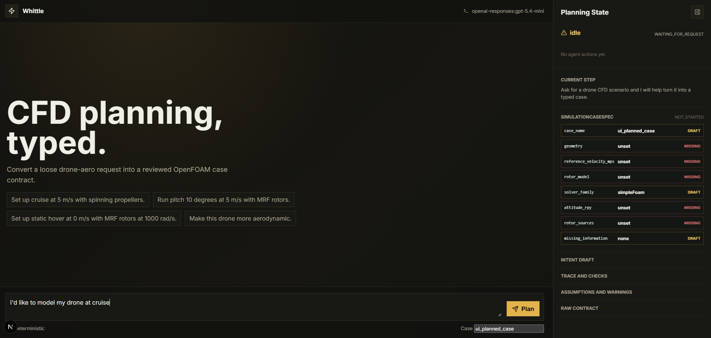
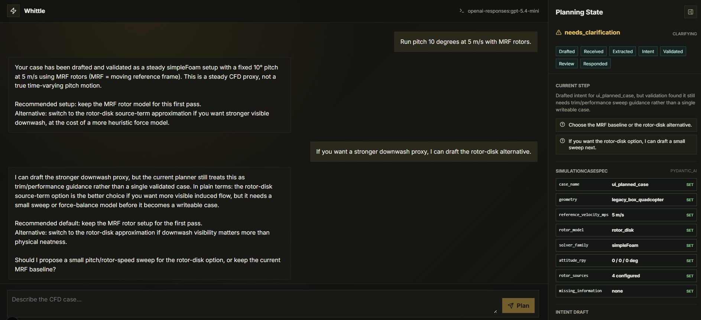
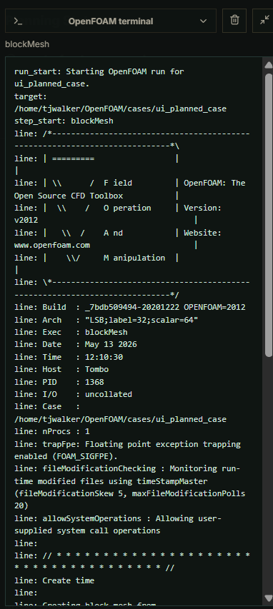
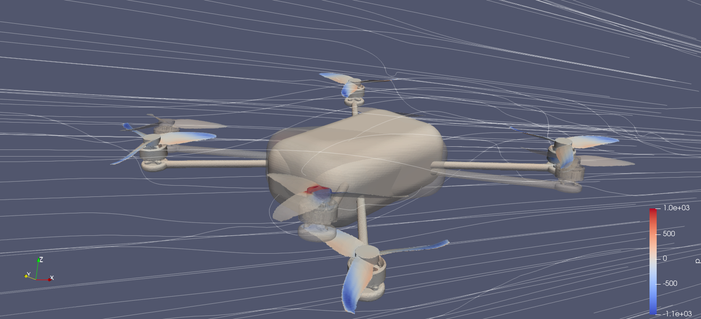
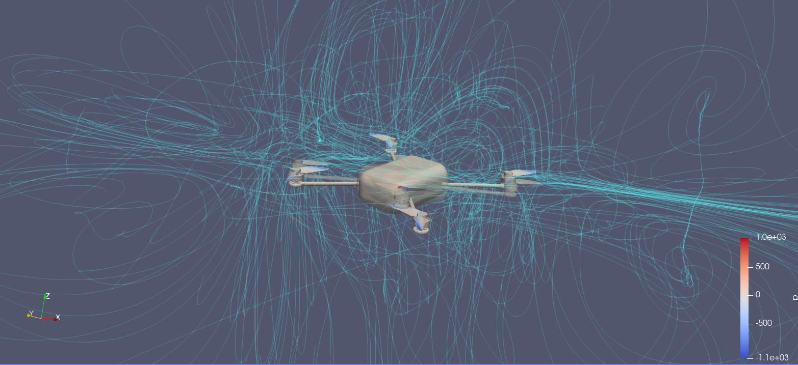

# Whittle

Whittle is a compact AI-engineering and CFD case-setup prototype for drone
aerodynamics. It turns a messy natural-language request into typed,
human-reviewable OpenFOAM setup state, then uses deterministic Python tools to
write an inspectable case skeleton.

The project was built as interview preparation for agentic engineering work:

```text
messy request -> ScenarioIntent -> SimulationCaseSpec -> validation/evals -> human review -> OpenFOAM files
```

The emphasis is not "weekend CFD automation". The emphasis is a
production-shaped pattern for engineering agents: typed contracts, bounded
tools, deterministic validation, traceable actions, and explicit human
checkpoints.

## What It Demonstrates

- A PydanticAI planning agent with deterministic fallback.
- Pydantic v2 schemas as workflow contracts, especially `ScenarioPlan` and
  `SimulationCaseSpec`.
- Deterministic CFD setup tools for OpenFOAM case generation.
- A machine-checkable physics envelope for supported drone scenarios.
- Local FastAPI endpoints and a Next.js review UI.
- Planning eval fixtures and pytest coverage.
- Optional Pydantic Logfire instrumentation for agent/API tracing.

## Current CFD Scope

Supported:

- external steady incompressible drone aero setup;
- legacy quadcopter demo geometry;
- fixed roll/pitch/yaw attitude transforms;
- Moving Reference Frame (MRF) rotor-zone smoke cases;
- rotor-disk source-term cases for stronger downwash-oriented experiments;
- caveated differential-rotor motion proxy cases.

Deliberately out of scope:

- validated performance claims;
- automatic CAD redesign;
- blade-resolved transient rotor CFD;
- takeoff, landing, floor, or ground-effect modelling;
- unsupervised production solver execution.

## Screenshots

The local UI turns a rough drone CFD request into typed scenario state, visible
trace events, and a reviewed case-writing action.

| Start of conversation | Mid-conversation planning |
| --- | --- |
|  |  |

The same workflow can write OpenFOAM cases and stream a local WSL run from the
review UI.



The ParaView screenshots below were generated from local OpenFOAM/ParaView
runs. They are visual inspection aids, not validation evidence.

| MRF and attitude transform | Rotor-disk downwash experiment |
| --- | --- |
|  |  |

## Public Assets

The repo includes the split quadcopter STL surfaces used by the current
`legacy-box` scenarios:

```text
assets/legacy_box_quadcopter/triSurface
```

These are the out-of-the-box geometry assets for the MRF, rotor-disk, and
roll/pitch/yaw attitude cases. A fresh clone can generate the same quadcopter
case family without needing the separate monolithic hexacopter CAD.

If you want to share richer geometry separately, use a read-only Drive link and
document where to place it locally, for example:

```text
cad/drone_model_hex.stl
```

The separate monolithic hexacopter CAD and generated OpenFOAM outputs remain
ignored under `cad/`, `CAD/`, and `outputs/`. Do not commit solver outputs,
logs, or raw `.env` files.

## Quick Start

Prerequisites:

- Python 3.11+
- `uv`
- Node.js 20+ for the optional UI
- WSL Ubuntu + OpenFOAM v2012 only if you want to run generated cases
- ParaView only if you want to inspect solver outputs visually

Install Python dependencies:

```bash
uv sync --extra dev
```

Run tests and lint:

```bash
uv run pytest
uv run ruff check
```

Plan a natural-language request deterministically:

```bash
uv run whittle plan-request "Set up external cruise over a quadcopter at 10 m/s with spinning propellers."
```

Run the PydanticAI planning entry point. Without `OPENAI_API_KEY`, Whittle uses
the deterministic fallback path:

```bash
uv run whittle agent-plan "Set up cruise at 5 m/s with spinning propellers." --case-name agent_demo
```

Generate a public demo OpenFOAM case skeleton:

```bash
uv run whittle write-case --preset legacy-box --output outputs/legacy_box_v0
```

Generate a short MRF rotor smoke case:

```bash
uv run whittle write-case --preset legacy-box --rotor-model mrf --mrf-omega-rad-s 1000 --max-iterations 5 --write-interval 5 --output outputs/legacy_box_mrf_smoke
```

Generate all attitude smoke cases:

```bash
uv run whittle write-attitude-suite --output-root outputs --velocity 5 --mrf-omega-rad-s 1000 --max-iterations 5 --write-interval 5
```

Run deterministic planner evals:

```bash
uv run whittle eval-planner
```

## Optional API And UI

Backend:

```bash
copy backend\.env.example backend\.env
uv run uvicorn whittle.api.app:app --reload --reload-dir src --reload-dir backend --port 8000 --env-file backend/.env
```

Frontend:

```bash
cd frontend
copy .env.local.example .env.local
npm install
npm run dev
```

Open `http://localhost:3000`. The UI defaults to
`http://127.0.0.1:8000`.

The OpenAI key is optional for local exploration. If set, put it in
`backend/.env`:

```bash
OPENAI_API_KEY=...
WHITTLE_AGENT_MODEL=openai-responses:gpt-5.4-mini
WHITTLE_AGENT_THINKING=medium
```

## Optional OpenFOAM Run

Whittle can copy a reviewed generated case into WSL and run a fixed OpenFOAM
command sequence. This is intentionally local-only and non-destructive: it
creates a unique target under `~/OpenFOAM/cases`.

```powershell
uv run whittle run-openfoam --case-dir outputs/legacy_box_mrf_smoke --case-name legacy_box_mrf_smoke
```

Expected WSL/OpenFOAM setup:

```bash
source /opt/OpenFOAM/OpenFOAM-v2012/etc/bashrc
which blockMesh
which snappyHexMesh
which topoSet
which checkMesh
which simpleFoam
```

## Security Notes Before Public Sharing

- No secrets should be committed. `.env` files are ignored; only examples are
  tracked.
- `/health` does not reveal whether an API key is configured.
- API endpoints are localhost-only for this demo.
- API output paths are validated to stay inside the workspace.
- OpenFOAM execution is a fixed local WSL command sequence, not a general shell
  exposed to the model.
- Do not expose the demo API directly to the public internet without adding
  authentication, rate limiting, and deployment-specific sandboxing.

## Repo Map

```text
src/whittle/models/        Pydantic contracts
src/whittle/tools/         deterministic planning, geometry, physics, validation tools
src/whittle/agents/        PydanticAI planning agent and prompts
src/whittle/openfoam/      OpenFOAM case writer and WSL runner
src/whittle/api/           FastAPI app
frontend/                  local Next.js review UI
tests/                     pytest coverage and planner eval smoke tests
docs/context/              architecture, schema, and physics-envelope notes
docs/runbooks/             setup and OpenFOAM workflow notes
```

More detail:

- `docs/context/overview.md`
- `docs/context/schema-guide.md`
- `docs/context/physics-envelope.md`
- `docs/runbooks/dev-setup.md`
